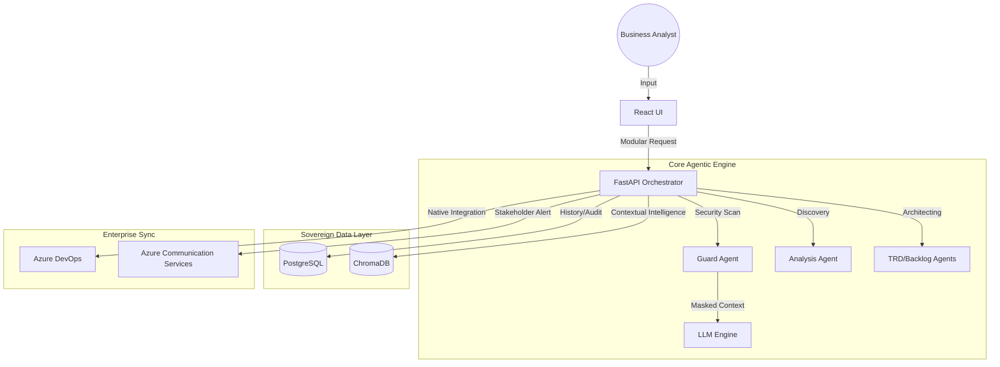

# BA Agent Pro: Unified Technical & Solution Specification
**The Intelligent Enterprise Discovery & Governance Platform**

---

## Table of Contents
1. [Executive Summary](#1-executive-summary)
2. [Project Scope](#2-project-scope)
3. [Technology Stack](#3-technology-stack)
4. [Layered Architecture Deep-Dive](#4-layered-architecture-deep-dive)
    - 4.1 [Presentation Layer (UI/UX)](#41-presentation-layer-uiux)
    - 4.2 [API & Orchestration Layer](#42-api--orchestration-layer)
    - 4.3 [Agentic Intelligence Layer](#43-agentic-intelligence-layer)
    - 4.4 [Data & Persistence Layer](#44-data--persistence-layer)
5. [System Architecture](#5-system-architecture)
6. [Process Flow & Agentic Lifecycle](#6-process-flow--agentic-lifecycle)
7. [Enterprise Governance & Security](#7-enterprise-governance--security)
    - 7.1 [Zero-Knowledge Privacy Shield](#71-zero-knowledge-privacy-shield)
    - 7.2 [Requirement Traceability Matrix](#72-requirement-traceability-matrix)
    - 7.3 [Audit & Compliance Vault](#73-audit--compliance-vault)
8. [Azure Ecosystem Integration](#8-azure-ecosystem-integration)
9. [Business Value & ROI](#9-business-value--roi)

---

## 1. Executive Summary
BA Agent Pro is a state-of-the-art **Agentic Discovery Engine** designed to solve the "Discovery Bottleneck" in enterprise software engineering. By utilizing a multi-agent orchestration model, the platform automates the transformation of raw business requirements into high-fidelity, development-ready artifacts. The system is grounded in **Enterprise Governance**, ensuring that every output is hallucination-free, secure, and digitally traceable to its source.

## 2. Project Scope
The scope of BA Agent Pro covers the entire pre-development lifecycle:
- **Intelligent Ingestion**: Automated extraction from BRD/PRD documents.
- **Requirement Engineering**: Gap analysis, persona-based reviews, and technical spec generation.
- **Visual Modeling**: Automated process flow diagramming.
- **DevOps Synchronization**: Native, hierarchical syncing to Azure DevOps.
- **Governance**: Active PII masking and absolute traceability mapping.

## 3. Technology Stack
| Layer | Technologies |
| :--- | :--- |
| **Frontend** | React 18, Vite, Vanilla CSS, React-Markdown, Mermaid.js |
| **Backend** | FastAPI (Python 3.10+), SQLAlchemy, Pydantic |
| **AI / LLM** | Groq (Llama 3.1 70B), Azure OpenAI (Embeddings) |
| **Data** | PostgreSQL (Flexible Server), ChromaDB (Vector Store) |
| **Cloud / Infra** | Azure App Service, Azure Container Instances (ACI), Azure Blob Storage |
| **Integration** | Azure DevOps REST API, Azure Communication Services (ACS) |

---

## 4. Layered Architecture Deep-Dive

### 4.1 Presentation Layer (UI/UX)
The UI is built as a **High-Density Professional Dashboard**.
- **Modular Entry**: A "Toolkit" approach allowing BAs to launch specific agents (Gap Detective, Spec Architect) on-demand.
- **Real-Time Visualization**: Dynamic rendering of process flows and requirement-to-story traceability matrices.
- **State Management**: React-based state recovery allowing users to resume historical discovery sessions seamlessly.

### 4.2 API & Orchestration Layer
The **RequifyOrchestrator** manages the "Mission Control" of the application.
- **Asynchronous Processing**: Uses non-blocking Python `asyncio` to execute multiple agent tasks in parallel.
- **Modular Logic**: Respects user-defined feature flags to optimize AI token usage and response times.
- **State Vault**: Persists project metadata and "Project DNA" to ensure context consistency across sessions.

### 4.3 Agentic Intelligence Layer
A suite of specialized agents, each with a focused "Job Description":
- **Analysis Agent**: Performs multi-perspective reviews (Architect, Security, Developer).
- **TRD Agent**: Translates raw text into structured technical specifications.
- **Backlog Agent**: Architects the Epic/Feature/Story hierarchy with MoSCoW prioritization.
- **Guard Agent**: The "QA Inspector" that masks PII and verifies backlog integrity.

### 4.4 Data & Persistence Layer
- **Relational (PostgreSQL)**: Stores sessions, audit logs, and document metadata.
- **Vector (ChromaDB)**: Stores project-specific embeddings for the RAG engine.
- **Project DNA**: Implements a 10-day TTL context cache to improve AI accuracy and reduce costs.

---

## 5. System Architecture

---

## 6. Process Flow & Agentic Lifecycle
1. **Ingestion & Safety**: Document upload triggered ➔ PII Masking applied ➔ Relevance check.
2. **Analysis & Modeling**: Parallel execution of Gap Analysis and Visual Process Flow generation.
3. **Engineering Phase**: TRD generation followed by Hierarchical Backlog architecture.
4. **Governance Review**: Integrity report generated ➔ Traceability Matrix rendered ➔ Stakeholder notification.
5. **Synchronization**: Selective sync to Azure DevOps with Upsert (Update/Insert) logic.

---

## 7. Enterprise Governance & Security

### 7.1 Zero-Knowledge Privacy Shield
Active masking replaces sensitive data (Emails, Keys, Credentials) with secure placeholders before AI transmission.

### 7.2 Requirement Traceability Matrix (RTM)
A digital "Chain of Evidence" mapping every Azure DevOps story back to its exact source requirement in the TRD.

### 7.3 Audit & Compliance Vault
A persistent, immutable-style log of all synchronization events, actions, and actors for IT compliance audits.

---

## 8. Azure Ecosystem Integration
- **Azure DevOps**: Surgical JSON-Patch synchronization of work items.
- **PostgreSQL**: Managed Flexible Server for highly available state storage.
- **ACS**: Automated dispatch of branded requirement approval emails.

---

## 9. Business Value & ROI
- **Efficiency**: 60% reduction in document-to-backlog turnaround time.
- **Quality**: Elimination of AI hallucinations through automated integrity guardrails.
- **Compliance**: Enterprise-grade data protection and absolute requirement traceability.
