# Process Flow: The Discovery Lifecycle

## 1. End-to-End Discovery Pipeline
The following flow describes the automated transition from raw input to synchronized engineering artifacts.

```mermaid
sequenceDiagram
    participant BA as Business Analyst
    participant ORC as Orchestrator
    participant GUARD as Guard Agent
    participant AI as AI Agents (Analysis/TRD/Backlog)
    participant ADO as Azure DevOps

    BA->>ORC: Uploads BRD / Selects Modules
    ORC->>GUARD: Scan for PII & Relevance
    GUARD-->>ORC: Masked Text & Safety Report
    
    rect rgb(30, 30, 30)
    Note over ORC, AI: Modular Execution Phase
    ORC->>AI: Analyze Gaps & Persona Reviews
    ORC->>AI: Generate Technical Spec (TRD)
    ORC->>AI: Architect Visual Process Flow
    ORC->>AI: Engineer Backlog Hierarchy
    end
    
    AI-->>ORC: Consolidated Discovery Data
    ORC-->>BA: Render Discovery Workspace
    
    BA->>BA: Review Traceability Matrix & Backlog
    BA->>ORC: Approve & Sync
    ORC->>GUARD: Final Integrity Check
    ORC->>ADO: Upsert Work Items (Selective Sync)
    ADO-->>ORC: Remote IDs Linked
    ORC-->>BA: Sync Success & Audit Recorded
```

## 2. Key Procedural Logic

### A. Modular Orchestration
The BA can choose to run specific "Quick Tools" (e.g., *just* the Gap Detective).
- **Logic**: The Orchestrator filters the `enabled_modules` list and only invokes the corresponding agents.
- **Benefit**: Optimized AI token spend and faster turnaround for targeted tasks.

### B. Iterative Discovery (Resume Analysis)
If a BA returns to an existing project:
1. The system fetches the `analysis_id` from PostgreSQL.
2. It restores the **Project State** from the cache.
3. Any changes to the backlog are compared against existing **Remote IDs**, triggering a `PATCH` (update) instead of a `POST` (duplicate).

### C. Governance & Integrity Check
Before synchronization, the `GuardAgent` performs an **Integrity Cross-Reference**:
- It compares the generated Backlog against the original TRD.
- It identifies "Hallucinations" (features not in the TRD) and "Coverage Gaps" (TRD items missing from the backlog).
- It provides a **Safety Score** to the BA.
