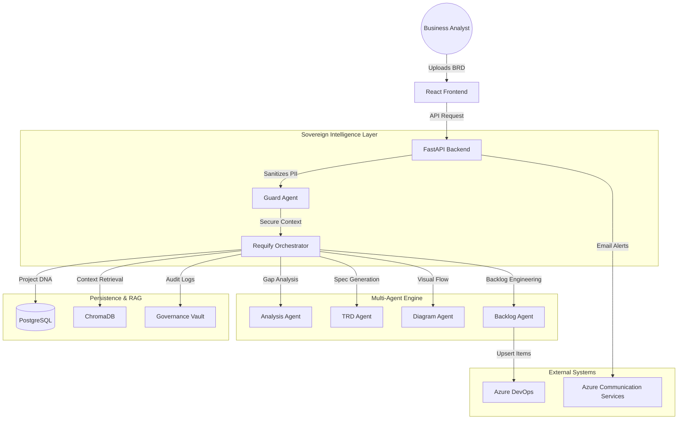

# System Architecture: BA Agent Pro

## 1. High-Level Overview
BA Agent Pro is an enterprise-grade agentic discovery platform designed to transform raw business requirements into development-ready engineering artifacts. The system utilizes a **Multi-Agent Orchestration** model with a **Zero-Knowledge Privacy Shield**.

### Tech Stack
- **Frontend**: React (Vite), Vanilla CSS (High-Density Design), React Markdown.
- **Backend**: FastAPI (Asynchronous Python), SQLAlchemy.
- **AI/LLM**: Groq (Llama 3.1), Azure OpenAI (for fallback).
- **Data Persistence**: PostgreSQL (Flexible Server), ChromaDB (Vector Store for RAG).
- **Integration**: Azure DevOps REST API, Azure Communication Services (ACS).

## 2. Component Architecture

## 3. Security Architecture: The Privacy Shield
The system implements an **Active Privacy Hook**. Before any data is transmitted to external LLM providers:
1. **PII Detection**: The `GuardAgent` scans for sensitive patterns (Emails, Keys, Credentials).
2. **Surgical Redaction**: All detected PII is replaced with secure placeholders (e.g., `[EMAIL_REDACTED]`).
3. **Zero-Knowledge Analysis**: The AI reasoning happens exclusively on the technical logic, never seeing the sensitive identities.

## 4. Data Sovereignty
- **Audit Logs**: Every state change and synchronization event is recorded in the `audit_logs` table for compliance.
- **Project DNA**: 10-day TTL (Time-to-Live) caching for project context to minimize external token usage and cost.
